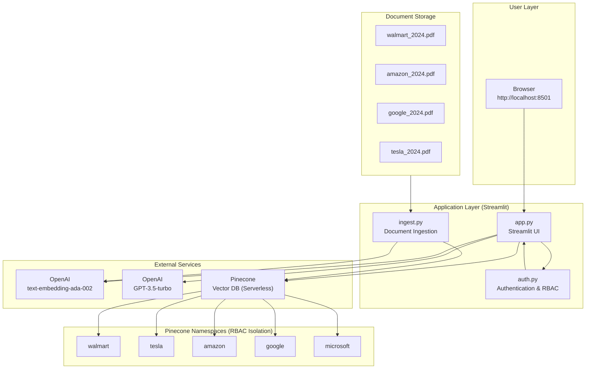
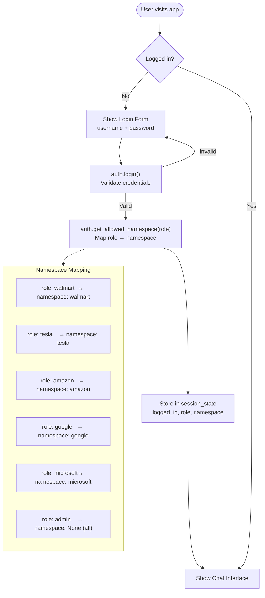
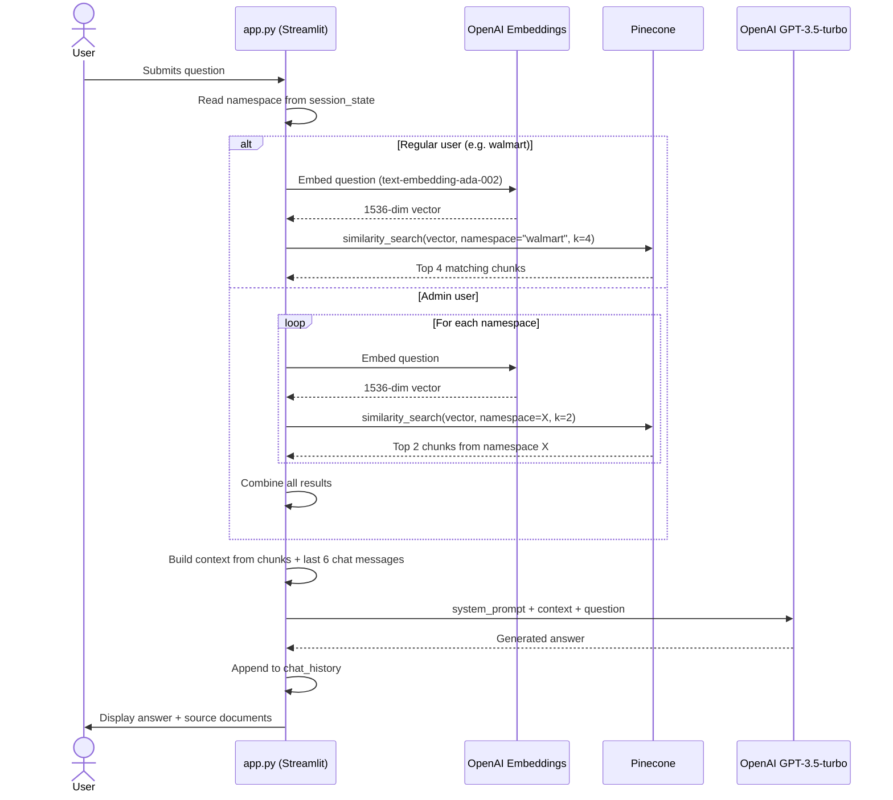
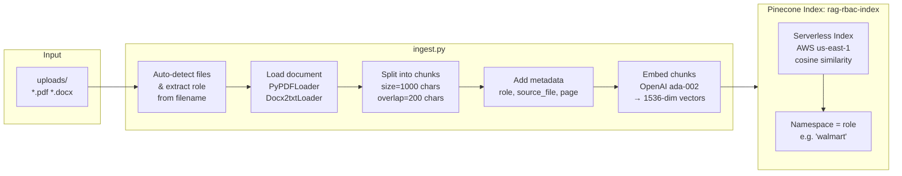
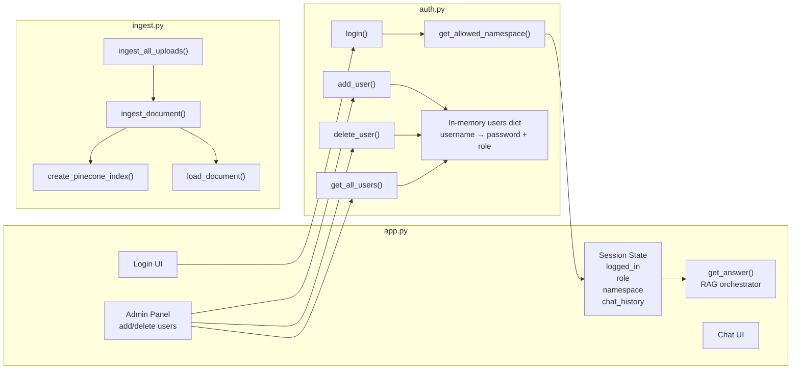
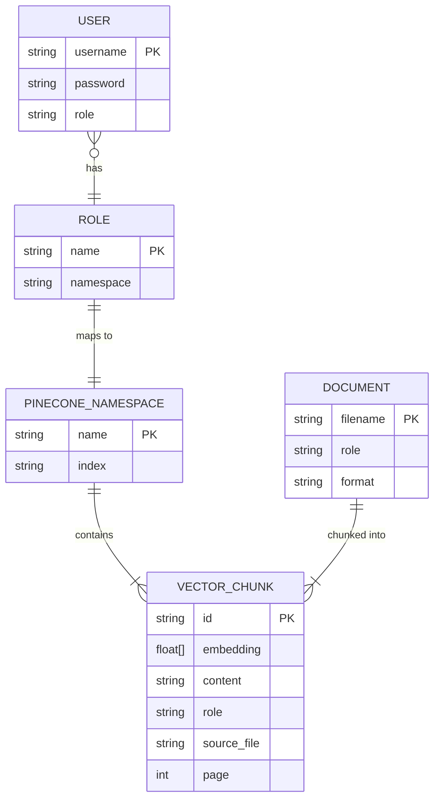

# RAG RBAC Chatbot — Architecture

## System Overview

---

## Authentication & Role-Based Access Control

---

## RAG Query Pipeline

---

## Document Ingestion Pipeline

---

## Component Breakdown

---

## Data Model

---

## Technology Stack

| Layer | Technology | Purpose |
|---|---|---|
| Frontend | Streamlit | Web UI, session management |
| Auth | Python dict (auth.py) | User store, RBAC logic |
| Embeddings | OpenAI text-embedding-ada-002 | Convert text → 1536-dim vectors |
| LLM | OpenAI GPT-3.5-turbo (temp=0) | Answer generation |
| Vector DB | Pinecone Serverless (AWS us-east-1) | Semantic search with namespace isolation |
| Doc Loading | PyPDFLoader, Docx2txtLoader | Parse PDFs and DOCX files |
| Orchestration | LangChain | Chains embeddings, retrieval, and LLM calls |
| Config | python-dotenv | Load API keys from `.env` |
